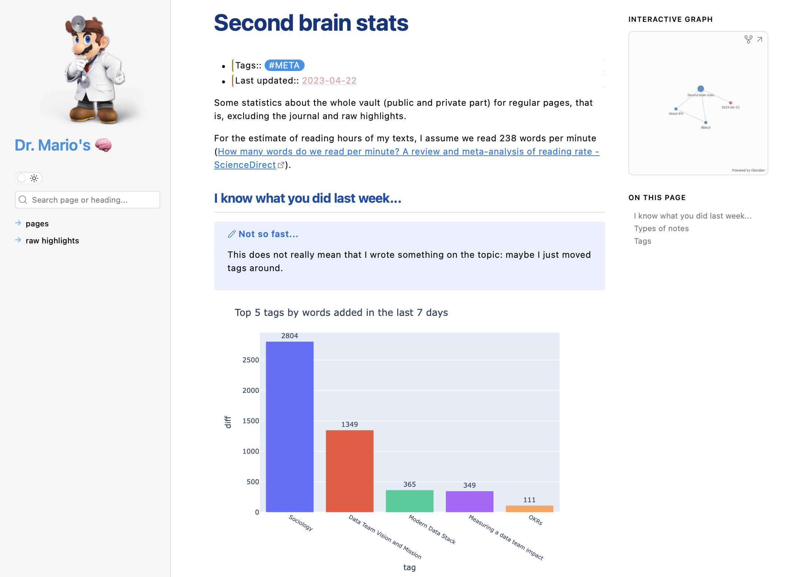

# 📊 Obsidian-metrics
PySpark code to compute metrics from my Obsidian vault.
You can nose around at [Second brain stats - Dr. Mario's 🧠](https://brain.drmario.tech/pages/Second+brain+stats)

## Want to use it?
It is a bit custom made, but you may be able to use it, paying attention to the following assumptions:
- Subfolders in your notes folder won't be considered.
- Most of my notes contain a line like `-Tags:: [[tag1]], #tag2`. Those are considered the "tags" of that note. 
- There is a special list of tags that are considered "note types" (`main.py/NOTE_TYPES`). A note has only one type (with the exception of '📚Books' and '✒️SummarizedBooks', which usually appear together, but '✒️SummarizedBooks' is then considered as the type of the note. A book I read but did not summarize has '📚Books' type).

## How to use it
You will need Docker.
1. Customize your note types as per the above.
2. Change the path to your vault pages in `Makefile/PAGES_VAULT_PATH`.
3. Change the path to where you store your attachments in `Makefile/ASSETS_VAULT_PATH`.
4. Run `make build` to build the custom Docker image used to run the code. The image is a minor modification of [the jupyter-all-spark-notebook — Docker Stacks documentation](https://jupyter-docker-stacks.readthedocs.io/en/latest/using/selecting.html#jupyter-all-spark-notebook).
5. Run `make daily-cronjob` to generate the metrics.

The code will copy your pages from your Obsidian vault to this folder, and then run Spark in local mode (but with parallelization) to compute the metrics. From those metrics, it will create several SVG files that it will copy back to your assets folder in your vault.

If you need to customize stuff on top of it, know that **I also added a VSCode devcontainer config**. And I have tests! What else can you ask for?

## Do you really need PySpark for this?
Of course not.

